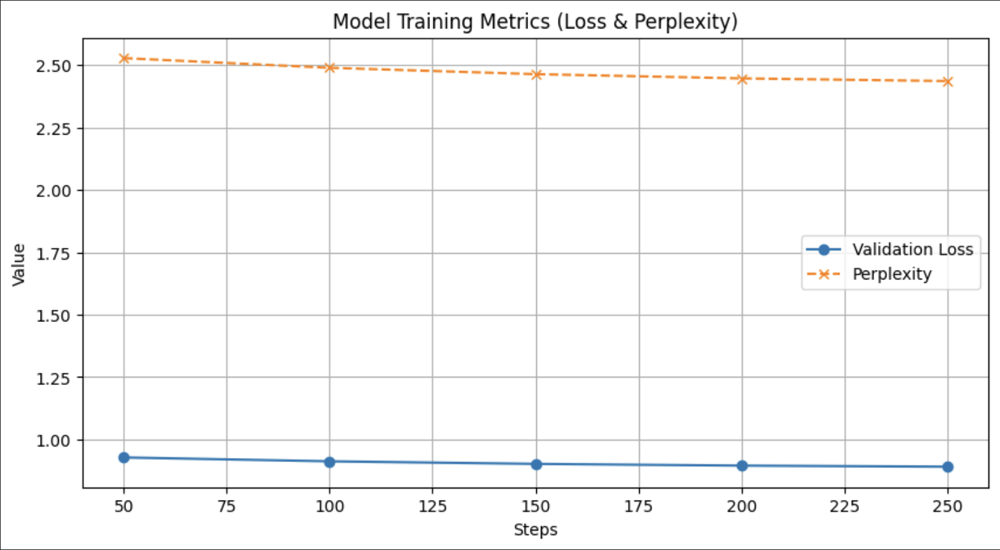

# ID2223 Scalable Machine Learning - Lab 2: Fine-Tuning & Deployment of LLMs

**Authors:** Emanuele Minotti, Stefano Romano

## 🎯 Project Overview

This laboratory focuses on the full pipeline of **Fine-Tuning Large Language Models (LLMs)** using Parameter-Efficient Fine-Tuning (PEFT) techniques. Our goal was to transform general-purpose base models into instruction-following assistants and, subsequently, domain-specific experts.

The project is divided into two main stages:
1. **Model Exploration & Benchmarking:** Fine-tuning and comparing three different model sizes (1B, 3B, and 8B) on a general instruction dataset to analyze scaling laws and performance.
2. **Domain Adaptation (VetAI):** Further specializing the best-performing model on a veterinary dataset to create a targeted medical assistant.

We utilized the **Unsloth** library for efficient training with 4-bit quantization and exported the final models to **GGUF** format for CPU-based inference via a user interface.

---

## 📊 Stage 1: Model Selection & Performance Analysis

We adopted a model-centric approach to improve performance. Instead of relying on a single configuration, we trained three distinct models using the **FineTome-100k** dataset. We experimented with increasing parameter counts and adjusted LoRA hyperparameters (Rank `r` and Alpha `lora_alpha`) to balance training efficiency with model expressivity.

To ensure an objective evaluation, we split the dataset into training and testing sets, monitoring **Validation Loss** and **Perplexity** every 50 steps.

### 🔹 Comparative Results

The table below summarizes the hyperparameters used and the best metrics achieved for each model configuration:

| Model | LoRA Rank | LoRA Alpha | Learning Rate | Train Batch Size | Grad. Accum. | Lowest Val Loss | Best Perplexity |
|:-----:|:---------:|:----------:|:-------------:|:----------------:|:------------:|:---------------:|:---------------:|
| **Llama-3.2-1B** | 16 | 16 | 2e-4 | 2 | 4 | **0.8906** | **2.4366** |
| **Llama-3.2-3B** | 16 | 16 | 2e-4 | 2 | 4 | **0.7266** | **2.0680** |
| **Meta-Llama-3.1-8B** | 32 | 32 | 1e-4 | 1 | 8 | **0.6474** | **1.9106** |

### 📝 Analysis

The empirical results provide clear evidence of the benefits of model scaling and hyperparameter tuning:

1.  **Scaling Impact:** There is a consistent improvement in downstream performance as model capacity increases.
    * Moving from the **1B** to the **3B** model resulted in a significant **21% reduction** in perplexity.
    * Scaling further from **3B** to **8B** yielded an additional **7.6% reduction**.
2.  **LoRA Parameterization:** For the largest model (8B), we increased the LoRA Rank and Alpha to 32 (compared to 16 for smaller models). This allowed the adapter to learn more complex patterns, contributing to the superior validation loss of **0.6474**.

### 📈 Training Curves

Each model was trained for **500 steps** to fit within compute constraints while ensuring convergence. The plots below visualize the validation loss and perplexity trends, showing smooth convergence for the larger models.

| Llama-3.2-1B | Llama-3.2-3B | Meta-Llama-3.1-8B |
|:------------:|:------------:|:-----------------:|
|  |  |  |

---

## 🐶 Stage 2: Domain-Specific Fine-Tuning (VetAI)

After identifying **Meta-Llama-3.1-8B** as the most capable model based on the metrics above, we proceeded to the second phase of the laboratory: domain adaptation.

Our objective was to build the engine for a **Veterinary Assistant App**. General-purpose instruction tuning makes the model helpful, but not necessarily expert in medical advice for pets.

### Approach
We performed a second stage of fine-tuning (SFT) using a specialized dataset:
* **Base Model:** The checkpoint of our fine-tuned Llama-3.1-8B.
* **Dataset:** A curated collection of veterinary questions and answers (pet health, nutrition, and emergency advice).
* **Technique:** We continued the training process for an additional epoch with a lower learning rate (`5e-5`) to refine the weights without catastrophic forgetting of general conversation abilities.

This two-stage process resulted in a model that maintains the conversational fluency of Llama-3.1 but possesses specific knowledge about animal care.

---

## 🚀 Deployment & User Interface

To make the model accessible on standard hardware (CPU-only environments), we merged the LoRA adapters into the base model and exported the result to **GGUF format** (8-bit quantization).

The final application is hosted on **Hugging Face Spaces**. It features a user-friendly Chat Interface where users can ask questions about their pets' health.

👉 **Try the VetAI Assistant here:** https://huggingface.co/spaces/stromano02/Iris

---

## 🛠️ How to Reproduce

1.  **Environment:** The code is designed to run on Google Colab (T4 GPU).
2.  **Dependencies:** Install `unsloth`, `transformers`, and `trl` as specified in the first cell of the notebook.
3.  **Data:** The notebook automatically handles data loading from Hugging Face (`mlabonne/FineTome-100k`) and the custom veterinary JSONL file.
